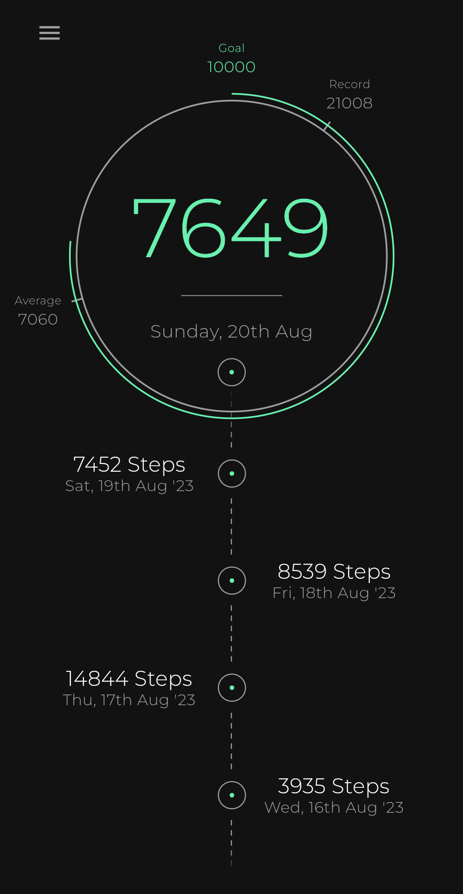

# Stepy

A step counter app written in Flutter

## How it works

The app uses three main Android components.

First is a hardware based step sensor which counts the steps taken.

Second is a Foreground service which keeps the step sensor registered 
in the SensorManager to hold it awake throughout the day.

Third is a Workmanager which fetches new steps from the sensor and 
updates daily steps taken roughly every 15 minutes.

## Design

The app uses BloC as a state management and Hive as a data storage for the steps taken
saved by date.

The pedometer and foreground plugins are Flutter plugin written in Kotlin.

Pedometer: https://github.com/LootExe/Pedometer

Foreground: https://github.com/LootExe/Foreground

## Pictures

 

